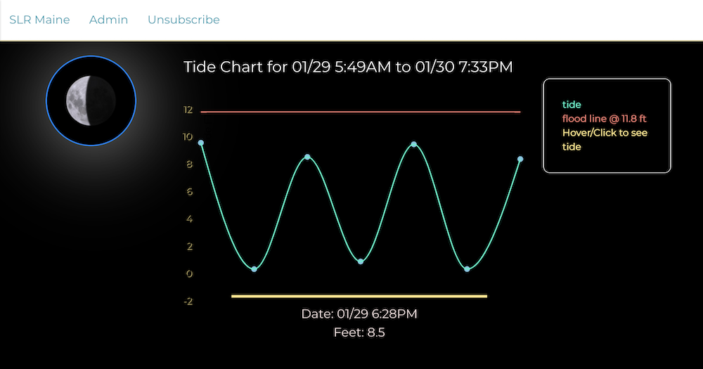

# Prototype SLR/Coastal Flooding Go Backend for GMRI / City of Portland 🌊

[Deployed Backend on Heroku](https://slr-maine.herokuapp.com/)

## SMS messaging service

> When a flooding event is *triggered* a `POST` is made to the database to record the event and the information from the same `POST` is used to autogenerate a `SMS message` to all the Subscribers in the database 🚏

## Routes

```haskell
SUBSCRIBERS TABLE
/subscribe
/subscribe/{phone}/delete/

DATA TABLE
/data/POST => SMS POST
/data/GETALL

ADMINS TABLE
/admins/{password}/ => verifies password/username of Admin
```

```js
go run *

go build
```


